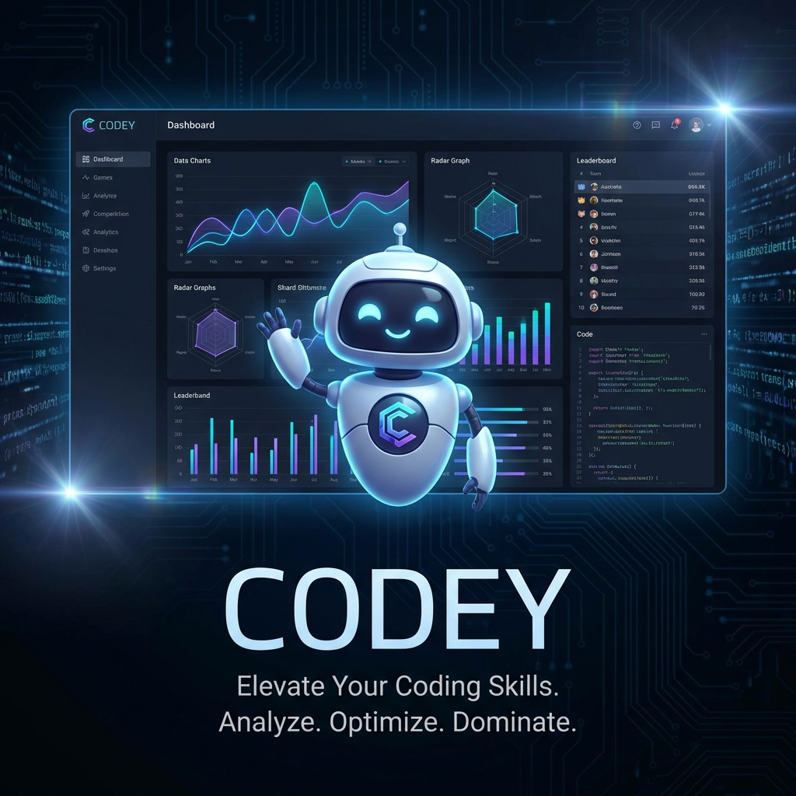

# 

# 🤖 Codey - The Ultimate Codeforces Dashboard & Analytics Platform

[](https://github.com/premshaw23/codey/actions)
[](https://opensource.org/licenses/MIT)
[](https://nextjs.org/)
[](https://tailwindcss.com/)
[](https://www.prisma.io/)

**Codey** is a premium, high-performance analytics and tracking platform designed specifically for Codeforces competitive programmers. It transforms raw data into actionable insights, helping you identify weaknesses, track progress, and sharpen your skills.

---

## ✨ Key Features

### 📊 Advanced Analytics & Insights
- **Rating Projections**: Visualise your future rating trends based on current performance.
- **Weakness Identification**: Automatically identifies tags and difficulty levels where you struggle.
- **Contest Performance**: Detailed breakdown of your performance in every Codeforces contest.

### 💻 Integrated Online Compiler (IDE)
- **Multi-Language Support**: Code in C++, Python, Java, and more with full syntax highlighting.
- **Real-time Sync**: Your code is safely synced to local storage as you type.
- **Sample Testing**: Run against sample test cases officially provided by Codeforces.
- **Custom Test Cases**: Add your own test cases to edge-case your solutions.
- **Auto-Formatting**: Keep your code clean with one-click Prettier/Monaco formatting.

### 🔍 Smart Problem Explorer
- **8000+ Problems**: Browse the entire Codeforces problem set.
- **Advanced Filtering**: Filter by tags, rating ranges, and solved status.
- **Intelligent Caching**: Lightning-fast search powered by Redis and Prisma.

### 👥 Social & Comparison
- **User Comparison**: Compare your stats side-by-side with friends or top programmers.
- **Sharing**: Generate shareable links for your solutions and dashboard views.

---

## 🛠️ Tech Stack

| Layer | Technology |
| :--- | :--- |
| **Framework** | [Next.js 15+](https://nextjs.org/) (App Router) |
| **Language** | [TypeScript](https://www.typescriptlang.org/) |
| **Database** | [Prisma](https://www.prisma.io/) with [PostgreSQL (Neon)](https://neon.tech/) |
| **Caching** | [Redis](https://upstash.com/) (ioredis) |
| **UI/UX** | [Tailwind CSS 4](https://tailwindcss.com/), [shadcn/ui](https://ui.shadcn.com/), [Framer Motion](https://www.framer.com/motion/) |
| **State Management** | [React Query](https://tanstack.com/query/latest) & [Zustand](https://docs.pmnd.rs/zustand/) |
| **Editor** | [Monaco Editor](https://microsoft.github.io/monaco-editor/) |

---

## 🚀 Quick Start

### 1. Prerequisite
- Node.js 20+
- A PostgreSQL database (Neon recommended)
- (Optional) Redis server

### 2. Installation
```bash
# Clone the repository
git clone https://github.com/premshaw23/codey.git
cd codey

# Install dependencies
npm install
```

### 3. Environment Setup
Copy `.env.example` to `.env` and fill in your credentials:
```bash
DATABASE_URL="your_postgresql_url"
REDIS_URL="your_redis_url"
CF_API_KEY="your_api_key"
CF_API_SECRET="your_api_secret"
```

### 4. Database Initialization
```bash
npx prisma generate
npx prisma db push
```

### 5. Launch
```bash
npm run dev
```
Open [http://localhost:3000](http://localhost:3000) to see Codey in action!

---

## 📖 Documentation

Detailed documentation can be found in the [docs/](./docs) directory:
- [🚀 Scraper Architecture](./docs/SCRAPER_SOLUTION.md)
- [🔧 Troubleshooting Guide](./docs/TROUBLESHOOTING.md)
- [✅ Verification Protocols](./docs/VERIFICATION.md)
- [📅 Project Roadmap](./docs/codey-weekwise-plan.md)

---

## 🤝 Contributing

We love contributions! Please see our [CONTRIBUTING.md](./CONTRIBUTING.md) for guidelines on how to get started.

---

## 📝 License

This project is licensed under the **MIT License**. See the [LICENSE](./LICENSE) file for details.

---

## 📧 Connect

Developed with ❤️ for the CP community.
- **GitHub Issues**: [Report a bug](https://github.com/premshaw23/codey/issues)
- **Email**: shawprem217@gmail.com

---
<p align="center">
  <i>"Analyze. Optimize. Dominate."</i>
</p>
